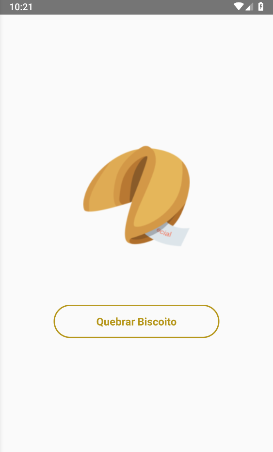

# Biscoito da Sorte
Projeto 2/4 de React Native Básico

## Explicação do Aplicativo 
Aplicativo simples que ao clicar no botão sorteia uma frase aleatória de biscoito da sorte.

 
   
  
   

 

**Versão 1.0** 
## Contributors 
- Raphael Satomi G. de Andrade <raphaelsatomiandrade@gmail.com>
